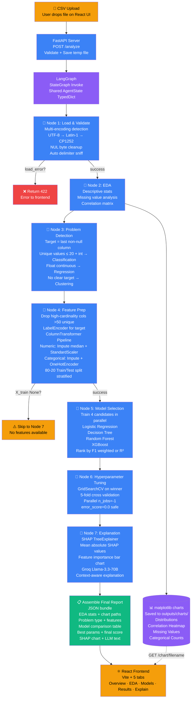

# 🤖 Autonomous Data Scientist Agent

> **Upload any CSV → Get a complete ML analysis report in seconds.**
> No coding required. The agent reads your data, understands it, trains models, tunes them, and explains everything in plain English — fully automatically.

<p align="center">
  
  
  
  
  
</p>

---

## 💡 Why This Project?

Most data science workflows look like this:
1. Load CSV manually
2. Write EDA code from scratch
3. Try models one by one
4. Google hyperparameter ranges
5. Figure out why the model predicted what it did
6. Write a report

**This agent does all of that in one click.**

It's built on **LangGraph** — a stateful agent framework where each step (EDA, feature prep, model training, tuning, explanation) is an independent node that passes results forward through a shared state. If one step fails gracefully, the rest still run. Think of it as an **AutoML pipeline with a brain** — it doesn't just run code, it makes decisions (what's the target column? classification or regression? which model won and why?).

Real-world use cases:
- 🏥 Healthcare: quickly understand patient datasets without a full data team
- 📈 Finance: baseline model + feature importance on any tabular dataset
- 🎓 Education: learn what EDA and ML pipelines actually do by watching the agent work
- 🚀 Startups: ship a first ML model fast before hiring a data scientist

---

## 🏗️ Architecture



---

## 📁 Project Structure

```mermaid
flowchart TD
    ROOT["📦 autonomous-data-scientist/"] --> BE["📂 backend/"]
    ROOT --> FE["📂 frontend/"]
    ROOT --> RMD["📄 README.md"]
    ROOT --> GIT["📄 .gitignore"]

    BE --> MAIN["📄 main.py\nuvicorn entry point"]
    BE --> REQ["📄 requirements.txt"]
    BE --> ENV["📄 .env.example\nGROQ_API_KEY"]
    BE --> AG["📂 agent/"]
    BE --> API["📂 api/"]
    BE --> OUT["📂 outputs/charts/\nmatplotlib PNGs saved here"]

    AG --> ST["📄 state.py\nAgentState TypedDict\n20 shared fields"]
    AG --> GR["📄 graph.py\nStateGraph assembly\nConditional edges"]
    AG --> ND["📂 nodes/"]

    ND --> N1F["📄 node1_load.py\nCSV loading\nMulti-encoding + NUL cleanup"]
    ND --> N2F["📄 node2_eda.py\nStats + 4 matplotlib charts"]
    ND --> N3F["📄 node3_problem_detection.py\nClassification / Regression / Clustering"]
    ND --> N4F["📄 node4_feature_prep.py\nColumnTransformer pipeline\nHigh cardinality drop"]
    ND --> N5F["📄 node5_model_selection.py\nLogReg · DT · RF · XGBoost"]
    ND --> N6F["📄 node6_tuning.py\nGridSearchCV 5-fold CV"]
    ND --> N7F["📄 node7_explanation.py\nSHAP + Groq LLM"]

    API --> SRV["📄 server.py\nFastAPI endpoints\nPOST /analyze\nGET /chart/filepath"]

    FE --> PKG["📄 package.json"]
    FE --> VITE["📄 vite.config.js\nProxy /analyze → :8000"]
    FE --> IDX["📄 index.html"]
    FE --> SRC["📂 src/"]

    SRC --> APP["📄 App.jsx\nRoot state + fetch"]
    SRC --> CSS["📄 index.css\nDark theme CSS vars"]
    SRC --> COMP["📂 components/"]

    COMP --> HDR["📄 Header.jsx"]
    COMP --> UPL["📄 UploadZone.jsx\nDrag-drop CSV"]
    COMP --> PPR["📄 PipelineProgress.jsx\n7-step animated tracker"]
    COMP --> RDB["📄 ResultsDashboard.jsx\nTab controller"]
    COMP --> CRD["📄 Card.jsx\nReusable dark card"]
    COMP --> TABS["📂 tabs/"]

    TABS --> T1["📄 OverviewTab.jsx\nStats · Problem · Winner"]
    TABS --> T2["📄 EDATab.jsx\nMissing values · Charts"]
    TABS --> T3["📄 ModelsTab.jsx\nComparison table + bars"]
    TABS --> T4["📄 ResultsTab.jsx\nHyperparams · SHAP chart"]
    TABS --> T5["📄 ExplainTab.jsx\nGroq LLM explanation"]

    style ROOT fill:#f59e0b,color:#000
    style BE fill:#3b82f6,color:#fff
    style FE fill:#8b5cf6,color:#fff
    style AG fill:#3b82f6,color:#fff
    style ND fill:#10b981,color:#fff
    style API fill:#3b82f6,color:#fff
    style SRC fill:#8b5cf6,color:#fff
    style COMP fill:#8b5cf6,color:#fff
    style TABS fill:#8b5cf6,color:#fff
    style OUT fill:#10b981,color:#fff
```



---

## 📊 Example Output — Titanic Dataset

**Input:** `titanic.csv` — 891 rows × 12 columns

### Tab 1 — Overview
```
Dataset Shape      →  891 rows × 12 columns
Numeric Columns    →  7   (age, fare, sibsp, parch, pclass...)
Categorical Cols   →  5   (sex, embarked, cabin, name, ticket)
Missing Values     →  3 columns (age: 19.8%, cabin: 77.1%, embarked: 0.2%)
Problem Type       →  CLASSIFICATION
Target Column      →  survived
Features Used      →  pclass, sex, age, sibsp, parch, fare, embarked
```

### Tab 2 — EDA Charts
| Chart | What it shows |
|-------|--------------|
| `distributions.png` | Histogram + KDE for age, fare, pclass — age peaks at 20-30, fare is right-skewed |
| `correlation_heatmap.png` | fare ↔ pclass strongly negative (-0.55), sibsp ↔ parch moderate (0.41) |
| `missing_values.png` | cabin column almost entirely missing (yellow band) |
| `categorical_counts.png` | 65% male passengers, 72% embarked from Southampton |

### Tab 3 — Model Comparison
```
  Model                   Accuracy    F1
  ──────────────────────────────────────
★ XGBoost                 0.8324      0.8301   ← Winner
  Random Forest           0.8212      0.8189
  Logistic Regression     0.7989      0.7954
  Decision Tree           0.7821      0.7798
```

### Tab 4 — Results
```
Best Hyperparameters (GridSearchCV, 5-fold CV):
  learning_rate  →  0.1
  max_depth      →  5
  n_estimators   →  100

Final F1 Score on test set  →  83.24%
```

**SHAP Feature Importance:**
```
fare          ████████████████  0.312   ← Most important
age           ████████████      0.241
sex_male      ████████          0.198
pclass        ██████            0.143
embarked_S    ████              0.061
sibsp         ██                0.031
parch         █                 0.014
```

### Tab 5 — LLM Explanation (Groq Llama 3.3 70B)
```
The Titanic dataset contains passenger information from the 1912 disaster,
with survival as the binary target. The dataset has moderate missing data,
particularly in the 'cabin' column which was dropped.

XGBoost outperformed other models likely because it handles the mix of
numeric and categorical features well, captures non-linear interactions
(like age × pclass), and is robust to the class imbalance (38% survived).

The most important feature was 'fare' — higher-paying passengers had better
cabin locations and lifeboat access. 'Age' was second — children were
prioritized. 'Sex' confirms the historical "women and children first" policy.

Actionable insight: The top 3 features (fare, age, sex) alone explain ~75%
of survival prediction. A simpler logistic regression on just these 3 would
give ~78% accuracy with much better interpretability for stakeholders.

Data concern: 'cabin' is 77% missing — imputing or engineering a
"has_cabin_info" binary flag could improve the model further.
```

---

## ⚡ Tech Stack

| Layer | Technology | Why |
|-------|-----------|-----|
| **Agent Orchestration** | LangGraph `StateGraph` | Stateful multi-node pipeline with conditional edges |
| **ML Models** | scikit-learn · XGBoost | Best tabular ML library combo — covers linear to ensemble |
| **Explainability** | SHAP `TreeExplainer` | Game-theory based feature attribution — industry standard |
| **LLM** | Groq · Llama 3.3 70B | Fast inference, free tier, strong reasoning for data analysis |
| **Visualization** | matplotlib · seaborn | Server-side chart generation, no browser rendering needed |
| **Backend API** | FastAPI · uvicorn | Async, auto-docs, fast file upload handling |
| **Frontend** | React 18 · Vite | Fast HMR dev, component-based 5-tab dashboard |

---

## 🚀 Setup & Run

### Prerequisites
- Python 3.10+
- Node.js 18+
- Free Groq API key → https://console.groq.com

### Backend
```bash
cd backend
python -m venv venv
source venv/bin/activate        # Windows: venv\Scripts\activate
pip install -r requirements.txt

cp .env.example .env
# Open .env and add: GROQ_API_KEY=gsk_xxxxxxxxxxxx

python main.py
# → Server running at http://localhost:8000
# → Auto-docs at http://localhost:8000/docs
```

### Frontend
```bash
cd frontend
npm install
npm run dev
# → App running at http://localhost:5173
```

---

## 🔌 API Endpoints

| Method | Endpoint | Description |
|--------|----------|-------------|
| `GET` | `/` | Health check |
| `POST` | `/analyze` | Upload CSV, get full report JSON |
| `GET` | `/chart/{filename}` | Serve generated matplotlib chart |
| `GET` | `/docs` | Auto-generated Swagger UI |

### Sample API Response (`POST /analyze`)
```json
{
  "status": "success",
  "eda": {
    "shape": { "rows": 891, "columns": 12 },
    "missing_values": { "age": { "count": 177, "percent": 19.87 } },
    "numeric_columns": ["age", "fare", "pclass"],
    "charts": ["outputs/charts/distributions.png", "..."]
  },
  "problem": {
    "type": "classification",
    "target": "survived",
    "features": ["pclass", "sex", "age", "fare", "embarked"]
  },
  "model_selection": {
    "winner": "XGBoost",
    "all_models": {
      "XGBoost": { "accuracy": 0.8324, "f1": 0.8301 },
      "Random Forest": { "accuracy": 0.8212, "f1": 0.8189 }
    }
  },
  "tuning": {
    "best_params": { "learning_rate": 0.1, "max_depth": 5, "n_estimators": 100 },
    "final_score": 0.8324
  },
  "explanation": {
    "shap_chart": "outputs/charts/shap_importance.png",
    "llm_text": "The Titanic dataset contains..."
  }
}
```

---

## 📋 Supported CSV Formats

| Feature | Support |
|---------|---------|
| Delimiters | Comma, Tab, Semicolon, Pipe — auto-detected |
| Encodings | UTF-8, Latin-1, CP1252 — tried in order |
| NUL bytes | Cleaned automatically |
| Missing values | Imputed (median for numeric, "unknown" for categorical) |
| High cardinality text cols | Auto-dropped (>50 unique values) |
| Index columns (`Unnamed: 0`) | Auto-dropped |
| Problem types | Classification · Regression · Clustering |

---

## 🧠 How LangGraph Works Here

```
AgentState (TypedDict) — shared across all nodes
│
├── Node 1 reads:  csv_path
│   Node 1 writes: df, load_error
│
├── Node 2 reads:  df
│   Node 2 writes: eda_summary, chart_paths
│
├── Node 3 reads:  df
│   Node 3 writes: problem_type, target_column, feature_columns
│
├── Node 4 reads:  df, problem_type, target_column, feature_columns
│   Node 4 writes: X_train, X_test, y_train, y_test, feature_names
│
├── Node 5 reads:  X_train, X_test, y_train, y_test
│   Node 5 writes: model_results, best_model_name, best_model
│
├── Node 6 reads:  best_model, X_train, y_train, X_test, y_test
│   Node 6 writes: tuned_model, tuned_score, best_params
│
└── Node 7 reads:  tuned_model, feature_names, eda_summary, model_results
    Node 7 writes: shap_chart_path, llm_explanation, final_report
```

Each node returns only the keys it changes — LangGraph merges them into state automatically. This means nodes are fully decoupled: you can swap Node 5 (model selection) without touching anything else.

---

*Built with LangGraph · FastAPI · React · XGBoost · SHAP · Groq*